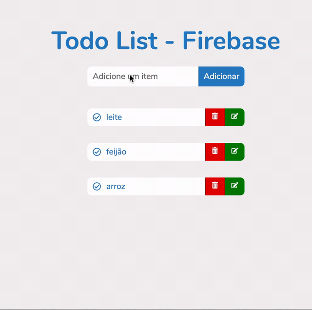

<h1 align="center">
    
</h1>

## 💻 About project

Project built with ReactJS to implement CRUD operations using Firebase in a todo list app.

## 🛠 Technology

#### **Website**

-   **[HTML5](https://developer.mozilla.org/pt-BR/docs/Web/HTML/HTML5)**
-   **[CSS3](https://www.w3schools.com/css/)**
-   **[ReactJs](https://pt-br.reactjs.org/)**

#### **Utilitaries**

-   Editor: **[Visual Studio Code](https://code.visualstudio.com/)**
-   Fonts: **[Nunito](https://fonts.google.com/specimen/Nunito)**

### Prerequisites

Before you begin, you will need to have the following tool installed on your machine:
[Git](https://git-scm.com)

In addition, it is good to have an editor to work with the code as **[VSCode](https://code.visualstudio.com/)**

### Running the web application (Front End)

```bash
# Clone this repository
$ git clone https://github.com/luizmr/todo-firebase.git

# Access the project folder in the cmd/terminal
$ cd todo-firebase

# Use the command below to install all dependencies
$ npm install

# Run the application on terminal
$ npm start

# The server is now running at localhost:3000
```

## 📝 License

This project is under the MIT license.

Made with ❤️ by Luiz Marcelo Rocha
